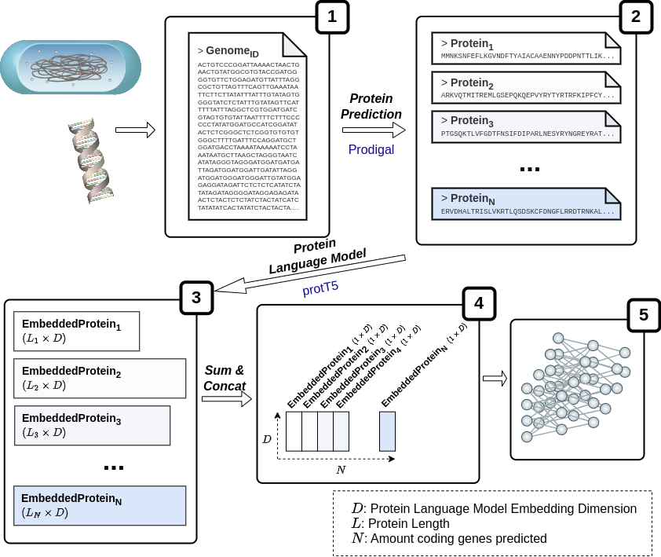
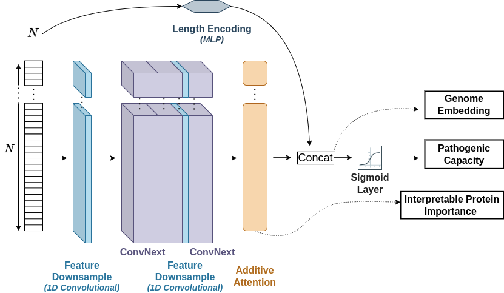

# PathogenFinder2
Prediction of bacterial pathogenic capacity on humans with protein Language Models.

This repository contains the code to run PathogenFinder2 through the commandline. If prefered, the program can also be runned (only for prediction) through its [webpage](https://genepi.food.dtu.dk/pathogenfinder). PathogenFinder2 consists of a main package (pathogenfinder2) that predicts the pathogenic capacity of a bacterial genome. The prediction is made through four steps:
1. Protein prediction: PathogenFinder2 uses Prodigal[1] to predict the protein content of the bacterial genome
2. Protein Embedding production: PathogenFinder2 uses ProtT5 to embed each protein into a vector.
3. Concat embeddings: Each vector is stacked in the same order as the proteins appear in the Prodigal prediction.
4. Deep Neural Model: The embeddings of the proteins are used as input for a deep neural network with convolutional layers and an attention layer.

<center></center>
<center>
</center>

The deep neural model is an ensemble of 4 neural networks that have beent trained with different splits of our data. Due to this, the prediction of the model is the mean of those 4 predictions. The model can also output the attention scores to look into which proteins have mattered the most for each prediction. Moreover, the model also reports the last layer of the neural network before the classification layer, as it can work as a sequence embedder based on its pathogenic capacity.

Besides, PathogenFinder2 has extra functionalities when predicting the pathogenic capacity, as mapping those embeddings to the Bacterial Pathogenic Landscape, as well as to align with DIAMOND [2] the top proteins highlighted by the attention layer to a protein database (UniRef50 [3]).

## Installation
For installation, please follow the description in this [link](./docs/Installation.md)

## Test usage
For a test/demo usage, please follow the description and explanation of outputs in this [link](./docs/Test.md)

## General Usage
**Important**: Any of the modes of the main module will improve its speed notably if used on a computer with GPU available. In particular, the steps infering the embeddings of each protein (using protT5) and the neural network to predict pathogenic capacity. The step for predicting the protein content, as well as mapping the embeddings or the proteins to a database (mapping submodule) will always run on CPUs.


### Main module

The main module of PathogenFinder2 can be used in 4 modes:
* **Predict**: Predicts pathogenic capacity using pre-trained weights for the neural network. The model can predict several inputs at the same time, although notice that the steps of protein prediction and embedding are not parallelized for several sequences. The input can be a genome in fasta file, a collection of proteins in fasta file, or an embeddings file in HDF5 format. 
* **Train**: Trains the neural network, with a training and validation dataset. Can only be done using embedding files (HDF5 format).
* **infer_proteomeLM**: Transforms a collection of genomes into the proteome embedding files (HDF5 format). Can be useful to transform a dataset before using it for training.
* **setup_gsea**: To install some optional dependencies. Please follow this [link](./docs/Installation.md) to know more.

In order to control the behavior of the software in each of the 4 modes, a json file can be used as input (as the one in *data/configs/config_empty.json*), or different arguments of the command line (only for *predict*).
```unix
>>> pathogenfinder2 -h
usage: Pathogenfinder2 [-h] {predict,train,infer_proteomeLM} ...

Command line version of PathogenFinder2. Contains the options to predict the pathogenic capacity using an already trained model, as well as mapping the embedding of the genomic sequence to
the Pathogenic Bacteria Landscape and aligning the highlighted proteins by the model to a protein database. "It also include options for training your own model, as well as testing an
already trained model.

options:
  -h, --help            show this help message and exit

PathogenFinder2 functionalities:
  {setup_gsea,predict,infer_proteomeLM,train}
    setup_gsea          Set up the data for GSEA
    predict             Predict bacterial pathogenic capacity with PathogenFinder2
    infer_proteomeLM    Predict the protein content and create its embeddings with Prodigal and protT5
    train               Train the PathogenFinder2 model for bacterial pathogenic capacity using your own data
```

### Predict
For predicting, it can be used on one sequence or multiple sequences. The input can be a genome, a proteome or the protT5 embeddings of those proteins.
```unix
>>> pathogenfinder2 predict -h
usage: Pathogenfinder2 [-h] {setup_gsea,predict,infer_proteomeLM,train} ...

Command line version of PathogenFinder2. Contains the options to predict the pathogenic capacity using an already trained model, as well as mapping the embedding of the genomic
sequence to the Pathogenic Bacteria Landscape and aligning the highlighted proteins by the model to a protein database. It also include options for training your own model, as well
as testing an already trained model.

options:
  -h, --help            show this help message and exit

PathogenFinder2 functionalities:
  {setup_gsea,predict,infer_proteomeLM,train}
    setup_gsea          Set up the data for GSEA
    predict             Predict bacterial pathogenic capacity with PathogenFinder2
    infer_proteomeLM    Predict the protein content and create its embeddings with Prodigal and protT5
    train               Train the PathogenFinder2 model for bacterial pathogenic capacity using your own data
(pathogenfinder2_env) (base) bash-5.1$ pathogenfinder2 predict -h
usage: Pathogenfinder2 predict [-h] [-v] [-d] [--verbose] [-c CONFIG] -o OUTPUTFOLDER [--prodigalPath PRODIGALPATH] [--diamondPath DIAMONDPATH] [-i INPUTFILE]
                               [--multipleFiles MULTIPLEFILES] -f {genome,proteome,embeddings} [--protT5Path PROTT5PATH] [--weightsModel WEIGHTSMODEL] [--embedProteome {report,map}]
                               [--attProteins {report,align}] [--cge] [--dbProteins DBPROTEINS] [--gsea] [--dbMetadataProteins DBMETADATAPROTEINS] [--minsize_gsea MINSIZE_GSEA]

options:
  -h, --help            show this help message and exit
  -v, --version         Show program's version number and exit
  -d, --debug           For debugging
  --verbose             Be verbose

General Input/Output options:
  General Input/Output options that can apply to any mode/functionality

  -c CONFIG, --config CONFIG
                        Config file (.json) with the configuration to run any of the PathogenFinder2 functionalities (only recommended for experienced users). It will overwrite any
                        of the commandline arguments, but provides full control of the model.
  -o OUTPUTFOLDER, --outputFolder OUTPUTFOLDER
                        Path to folder where to save the files produced by PathogenFinder2

Executable paths:
  Paths to executables or tertiary software that might be required by PathogenFinder2. Only required if the software is not included on the executable PATH.

  --prodigalPath PRODIGALPATH
                        Path to Prodigal executable.
  --diamondPath DIAMONDPATH
                        Path to Diamond executable

Pathogen Capacity prediction Options:
  Options for running the basic functionalities to predict pathogenic capacity of PathogenFinder2

  -i INPUTFILE, --inputFile INPUTFILE
                        Path to input for predicting the pathogenic capacity. The format must be described in the -f/--formatSeq argument
  --multipleFiles MULTIPLEFILES
                        Path to text file with paths to input files. This option allows for the prediction of bacterial pathogenic capacity of multiple bacterial genomes, by
                        parallelizing the neural network step.
  -f {genome,proteome,embeddings}, --formatSeq {genome,proteome,embeddings}
                        The format of the bacterial sequence(s).
  --protT5Path PROTT5PATH
                        Path to local protT5 model
  --weightsModel WEIGHTSMODEL
                        Path to the file(s) with weights used by the deep learning model to predict. If not selected, the model will use the weights provided by the authors.
  --embedProteome {report,map}
                        If used, report or/and map the embeddings to the Bacterial Pathogenic Landscape
  --attProteins {report,align}
                        If used, report the attentions or/and align the 20 proteins with highest attention score to a protein database
  --cge                 Save the predictions in the standard CGE output

Protein Alignment Options:
  Options for aligning the proteins of interest highlighted by PathogenFinder2

  --dbProteins DBPROTEINS
                        Path to protein database indexed with diamond to align the proteins highlighted by the attention layer
  --gsea                Run GSEA-like analysis on highlighted proteins
  --dbMetadataProteins DBMETADATAPROTEINS
                        Path to protein database metadata previously formated with setup_gsea
  --minsize_gsea MINSIZE_GSEA
                        Minimum size for a gene set to be included in gsea
```
If the options **--embedProteome** or **--attProteins** are used with *map* or *align*, respectively, the submodule *mapping* from PathogenFinder2 will be used (details on the [Installation](./docs/Installation.md) section) 


### Train 
For training, the different options (such as epoch count, file path, etc) must be indicated by the json file format. The input data must also be already embeddings files produced with protT5 (or with the function "Infer Protein Embeddings", as described below).
```unix
pathogenfinder2 train -h

usage: Pathogenfinder2 train [-h] [-v] [-d] [--verbose] [-c CONFIG] -o OUTPUTFOLDER [--prodigalPath PRODIGALPATH] [--diamondPath DIAMONDPATH]

options:
  -h, --help            show this help message and exit
  -v, --version         Show program's version number and exit
  -d, --debug           For debugging
  --verbose             Be verbose

General Input/Output options:
  General Input/Output options that can apply to any mode/functionality

  -c CONFIG, --config CONFIG
                        Config file (.json) with the configuration to run any of the PathogenFinder2 functionalities (only recommended for experienced users). It will overwrite any
                        of the commandline arguments, but provides full control of the model.
  -o OUTPUTFOLDER, --outputFolder OUTPUTFOLDER
                        Path to folder where to save the files produced by PathogenFinder2

Executable paths:
  Paths to executables or tertiary software that might be required by PathogenFinder2. Only required if the software is not included on the executable PATH.

  --prodigalPath PRODIGALPATH
                        Path to Prodigal executable.
  --diamondPath DIAMONDPATH
                        Path to Diamond executable
```
### Infer Protein Embeddings
Produces the protein embeddings predicted from genome files.
```unix
pathogenfinder2 infer_proteomeLM -h
usage: Pathogenfinder2 infer_proteomeLM [-h] [-v] [-d] [--verbose] [-c CONFIG] -o OUTPUTFOLDER [--prodigalPath PRODIGALPATH] [--diamondPath DIAMONDPATH] [-i INPUTFILE]
                                        [--multipleFiles MULTIPLEFILES]

options:
  -h, --help            show this help message and exit
  -v, --version         Show program's version number and exit
  -d, --debug           For debugging
  --verbose             Be verbose
  -i INPUTFILE, --inputFile INPUTFILE
                        Path to genome file to predict its protein content and create embeddings.
  --multipleFiles MULTIPLEFILES
                        Path to text file with paths to input files.

General Input/Output options:
  General Input/Output options that can apply to any mode/functionality

  -c CONFIG, --config CONFIG
                        Config file (.json) with the configuration to run any of the PathogenFinder2 functionalities (only recommended for experienced users). It will overwrite any
                        of the commandline arguments, but provides full control of the model.
  -o OUTPUTFOLDER, --outputFolder OUTPUTFOLDER
                        Path to folder where to save the files produced by PathogenFinder2

Executable paths:
  Paths to executables or tertiary software that might be required by PathogenFinder2. Only required if the software is not included on the executable PATH.

  --prodigalPath PRODIGALPATH
                        Path to Prodigal executable.
  --diamondPath DIAMONDPATH
                        Path to Diamond executable
```

## PathogenFinder2 Data
For more information about the dataset used for training and evaluating the model, please follow the [link](./docs/DataPF2.md) describing the folder *data/PF2_data*.

## Citation
When using the method please cite:
Alfred Ferrer Florensa, Jose Juan Almagro Armenteros, Rolf Sommer Kaas, Philip Thomas Lanken Conradsen Clausen, Henrik Nielsen, Burkhard Rost, Frank M Aarestrup, Whole-genome prediction of bacterial pathogenic capacity on novel bacteria using protein language models with PathogenFinder2, Bioinformatics, 2026;, btag129, https://doi.org/10.1093/bioinformatics/btag129 
## References
1. Hyatt, Doug, et al. "Prodigal: prokaryotic gene recognition and translation initiation site identification." BMC bioinformatics 11 (2010): 1-11.
2. Buchfink, Benjamin, Klaus Reuter, and Hajk-Georg Drost. "Sensitive protein alignments at tree-of-life scale using DIAMOND." Nature methods 18.4 (2021): 366-368.
3. Suzek, Baris E., et al. "UniRef clusters: a comprehensive and scalable alternative for improving sequence similarity searches." Bioinformatics 31.6 (2015): 926-932.

## License
Licensed under the Apache License, Version 2.0 (the "License"); you may not use this file except in compliance with the License. You may obtain a copy of the License at

http://www.apache.org/licenses/LICENSE-2.0

Unless required by applicable law or agreed to in writing, software distributed under the License is distributed on an "AS IS" BASIS, WITHOUT WARRANTIES OR CONDITIONS OF ANY KIND, either express or implied. See the License for the specific language governing permissions and limitations under the License.
